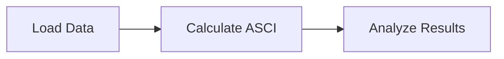

# Quick Start

Get your first ASCI calculation running in under 5 minutes.

## Basic Workflow

ASCICat follows a simple three-step workflow:



## Step 1: Import and Initialize

```python
from ascicat import ASCICalculator

# Initialize calculator for HER (Hydrogen Evolution Reaction)
calc = ASCICalculator(reaction='HER', verbose=True)
```

!!! info "Available Reactions"

    - `'HER'` - Hydrogen Evolution Reaction
    - `'CO2RR'` with pathway `'CO'`, `'CHO'`, or `'COCOH'`

## Step 2: Load Your Data

```python
# Load catalyst data from CSV
calc.load_data('data/HER_clean.csv')
```

Your CSV file should contain:

| Column | Description | Unit |
|:-------|:------------|:-----|
| `DFT_ads_E` | Adsorption energy | eV |
| `surface_energy` | Surface energy | J/m² |
| `Cost` | Material cost | $/kg |
| `symbol` | Catalyst identifier | - |

## Step 3: Calculate ASCI Scores

```python
# Calculate with equal weights (default)
results = calc.calculate_asci(
    w_a=0.33,  # Activity weight
    w_s=0.33,  # Stability weight
    w_c=0.34   # Cost weight
)

# Get top 10 catalysts
top10 = calc.get_top_catalysts(n=10)
print(top10[['symbol', 'ASCI', 'activity_score', 'stability_score', 'cost_score']])
```

## Complete Example

Here's a complete working example:

```python
from ascicat import ASCICalculator
from ascicat.visualizer import Visualizer

# 1. Initialize
calc = ASCICalculator(reaction='HER', verbose=True)

# 2. Load data
calc.load_data('data/HER_clean.csv')

# 3. Calculate ASCI
results = calc.calculate_asci(w_a=0.33, w_s=0.33, w_c=0.34)

# 4. View results
print("\nTop 10 HER Catalysts:")
print("-" * 60)
top10 = calc.get_top_catalysts(n=10)
for i, (_, row) in enumerate(top10.iterrows(), 1):
    print(f"{i:2}. {row['symbol']:12} ASCI={row['ASCI']:.3f}")

# 5. Generate figures
viz = Visualizer(results, calc.config)
viz.generate_figures(output_dir='results/')
```

## Output

After running, you'll see:

```
================================================================================
ASCICat Calculator Initialized
================================================================================

🔬 Reaction: HER
   Pathway: H adsorption
   Optimal Energy: ΔE_opt = -0.270 eV
   Description: Hydrogen Evolution Reaction (2H⁺ + 2e⁻ → H₂)

⚙️  Configuration:
   Activity Width: σ_a = 0.150 eV
   Scoring Method: LINEAR
   Default Weights: w_a=0.33, w_s=0.33, w_c=0.34 (EQUAL)
================================================================================

📂 Loading HER data from: data/HER_clean.csv

📊 Data Summary:
   Total catalysts: 48,312
   ...

✓ ASCI calculation complete!
   Processed: 48,312 catalysts
   Best ASCI: 0.9234
   Mean ASCI: 0.4521
   Top catalyst: Fe2Sb4
```

## Generated Figures

The visualizer creates four high-quality panels:

| Panel | Description |
|:------|:------------|
| **A** | 3D ASCI component space |
| **B** | Rank vs. adsorption energy |
| **C** | Volcano optimization landscape |
| **D** | Top performers breakdown |

All figures are saved at 600 DPI in PNG and PDF formats.

## Quick Reference

### Weight Scenarios

| Scenario | w_a | w_s | w_c | Use Case |
|:---------|:----|:----|:----|:---------|
| Equal | 0.33 | 0.33 | 0.34 | Unbiased screening |
| Activity-focused | 0.50 | 0.30 | 0.20 | Performance priority |
| Stability-focused | 0.30 | 0.50 | 0.20 | Durability priority |
| Cost-focused | 0.30 | 0.20 | 0.50 | Economic priority |

### One-Line Calculation

For quick analysis, use the convenience function:

```python
from ascicat import quick_asci

results = quick_asci(
    reaction='HER',
    data_file='data/HER_clean.csv',
    w_a=0.4, w_s=0.3, w_c=0.3
)
```

## Next Steps

- [First Analysis](first-analysis.md) - Detailed walkthrough
- [User Guide](../user-guide/index.md) - In-depth documentation
- [Tutorials](../tutorials/index.md) - Step-by-step examples
