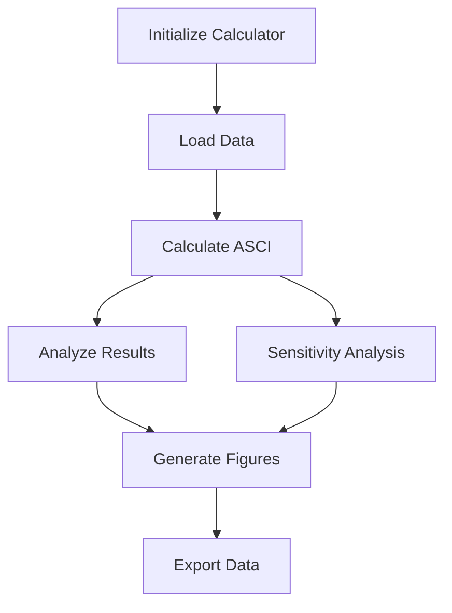

# User Guide

This comprehensive guide covers all aspects of using ASCICat for multi-objective catalyst screening.

## Overview

ASCICat provides a complete framework for:

- **Scoring** catalysts on activity, stability, and cost
- **Ranking** using customizable weight combinations
- **Visualizing** results with high-quality figures
- **Analyzing** sensitivity to weight choices

## Guide Structure

<div class="grid cards" markdown>

-   :material-head-lightbulb:{ .lg .middle } **Core Concepts**

    ---

    Understand the theoretical foundation and key principles

    [:octicons-arrow-right-24: Core Concepts](concepts.md)

-   :material-calculator:{ .lg .middle } **Scoring System**

    ---

    Detailed explanation of activity, stability, and cost scoring

    [:octicons-arrow-right-24: Scoring Overview](scoring/index.md)

-   :material-flask:{ .lg .middle } **Reactions**

    ---

    Configure HER, CO2RR, and custom reaction pathways

    [:octicons-arrow-right-24: Reactions](reactions/index.md)

-   :material-chart-bar:{ .lg .middle } **Visualization**

    ---

    Generate high-quality figures and interactive plots

    [:octicons-arrow-right-24: Visualization](visualization.md)

-   :material-chart-bell-curve:{ .lg .middle } **Sensitivity Analysis**

    ---

    Analyze weight dependencies and ranking robustness

    [:octicons-arrow-right-24: Sensitivity](sensitivity.md)

-   :material-database:{ .lg .middle } **Data Format**

    ---

    Prepare and validate your catalyst datasets

    [:octicons-arrow-right-24: Data Format](data-format.md)

</div>

## Quick Reference

### The ASCI Formula

$$\phi_{ASCI} = w_a \cdot S_a(\Delta E) + w_s \cdot S_s(\gamma) + w_c \cdot S_c(C)$$

### Score Definitions

| Score | Formula | Interpretation |
|:------|:--------|:---------------|
| Activity | $S_a = \max(0, 1 - \|\Delta E - \Delta E_{opt}\| / \sigma_a)$ | Proximity to Sabatier optimum |
| Stability | $S_s = (\gamma_{max} - \gamma) / (\gamma_{max} - \gamma_{min})$ | Inverse surface energy |
| Cost | $S_c = (\log C_{max} - \log C) / (\log C_{max} - \log C_{min})$ | Logarithmic cost penalty |

### Typical Weight Scenarios

| Scenario | $(w_a, w_s, w_c)$ | Use Case |
|:---------|:------------------|:---------|
| Equal (Default) | (0.33, 0.33, 0.34) | Unbiased exploratory screening |
| Activity-Focused | (0.50, 0.30, 0.20) | Performance-critical applications |
| Stability-Focused | (0.30, 0.50, 0.20) | Long-term durability required |
| Cost-Focused | (0.30, 0.20, 0.50) | Large-scale deployment |

### Supported Reactions

| Reaction | Pathway | $\Delta E_{opt}$ | $\sigma_a$ |
|:---------|:--------|:-----------------|:-----------|
| HER | H adsorption | -0.27 eV | 0.15 eV |
| CO2RR | CO | -0.67 eV | 0.15 eV |
| CO2RR | CHO | -0.48 eV | 0.15 eV |
| CO2RR | COCOH | -0.32 eV | 0.15 eV |

## Key Classes

```python
from ascicat import (
    ASCICalculator,    # Main calculation engine
    Visualizer,        # Figure generation
    Analyzer,          # Statistical analysis
    SensitivityAnalyzer,  # Weight sensitivity
    ReactionConfig,    # Reaction configuration
)
```

## Workflow Summary



## Best Practices

!!! success "Recommended Workflow"

    1. **Start with equal weights** for unbiased initial screening
    2. **Run sensitivity analysis** to understand weight dependencies
    3. **Identify robust candidates** that rank well across weight ranges
    4. **Document your weights** and rationale for reproducibility

!!! warning "Common Pitfalls"

    - Don't choose weights to favor a predetermined outcome
    - Don't ignore sensitivity analysis results
    - Don't compare rankings from different weight scenarios directly
    - Don't skip data validation

## Getting Help

- [API Reference](../api/index.md) - Complete function documentation
- [Tutorials](../tutorials/index.md) - Step-by-step examples
- [GitHub Issues](https://github.com/NabKh/ASCICat/issues) - Bug reports and questions
